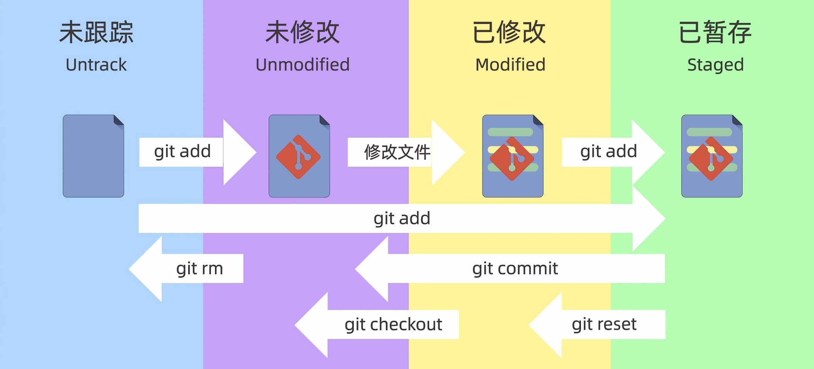

# Git 使用指南（Markdown 版·实操与速查）

> 面向日常开发与考试/面试快速复习。所有命令可在 Windows、macOS、Linux 的终端/PowerShell 使用；VS Code 部分含图形界面操作要点。

---

## 目录

- [安装和初始化配置](#安装和初始化配置)
- [新建仓库](#新建仓库)
- [工作区域和文件状态](#工作区域和文件状态)
- [提交和添加文件](#提交和添加文件)
- [git reset 回退版本](#git-reset-回退版本)
- [使用 git diff 查看差异](#使用-git-diff-查看差异)
- [使用 git rm 删除文件](#使用-git-rm-删除文件)
- [.gitignore 忽略文件](#gitignore-忽略文件)
- [SSH 配置和克隆仓库](#ssh-配置和克隆仓库)
- [关联本地仓库和远程仓库（GitHub）](#关联本地仓库和远程仓库github)
- [在 VS Code 中使用 Git](#在-vs-code-中使用-git)
- [分支简介和基本操作](#分支简介和基本操作)
- [解决合并冲突](#解决合并冲突)
- [回退和 rebase](#回退和-rebase)
- [分支管理和工作流模型](#分支管理和工作流模型)
- [常用速查](#常用速查)

---

## 安装和初始化配置

### 安装

- **Windows**：下载 [Git for Windows](https://git-scm.com) 并安装（自带 `git-bash`）。
- **macOS**：
  ```bash
  # 任选其一
  xcode-select --install      # 安装 Command Line Tools
  brew install git            # 用 Homebrew
  ```
- **Linux (Debian/Ubuntu)**：
  ```bash
  sudo apt update && sudo apt install -y git
  ```

### 初始化全局配置

```bash
# 用户信息（写入 ~/.gitconfig）
git config --global user.name "你的名字"
git config --global user.email "you@example.com"

# 存储配置
git config --global credential.helper store

# 查看 Git 配置信息
git config --global list

# 查看配置来源
git config --list --show-origin
```

---

## 新建仓库（Repository）

### 从零开始

```bash
mkdir myproj && cd myproj
git init <project-name>
# 创建一个新的本地仓库（省略project-name则在当前目录创建。）
```

### 从远端克隆

```bash
git clone https://github.com/user/repo.git
# 或用 SSH：
git clone git@github.com:user/repo.git
```

---

## 工作区域和文件状态

```bash
┌──────────┐   git add     ┌────────────┐   git commit    ┌──────────────┐
│ 工作区WD │ ───────────▶ │ 暂存区INDEX│ ─────────────▶ │ 本地仓库LOCAL │
└──────────┘   撤销:       └────────────┘   回退:         └──────────────┘
     ▲          git restore --staged <file>   git reset --soft/mixed/hard
     │
     └────── git checkout/restore <file>（丢弃工作区修改）
# 工作区 .git
# 暂存区 .git/index
# 本地仓库 .git/objects
```

**查看状态与对象**

```bash
git status         # 状态总览
git ls-files       # 已跟踪文件列表
```

**文件状态术语**



- **Untracked**：未被 Git 跟踪
- **Unmodified**：已被 Git 跟踪
- **Modified**：已跟踪且被修改
- **Staged**：已加入暂存区
- **Committed**：提交到本地仓库

---

## 提交和添加文件

```bash
git status # 查看仓库的状态
git add # 添加到暂存区
git commit # 提交

echo "hello" > README.md

# 选择性添加
git add README.md     # 添加单个文件
git add src/          # 添加目录
git add -p            # 交互式分块添加

# 提交
git commit -m "feat: init project"

# 一步把所有已跟踪修改提交（不添加新文件）
git commit -am "fix: adjust config"

# 修改最近一次提交（信息或文件）
# ⚠️ 如果已推到公共分支，谨慎使用 --amend（会改历史）
git commit --amend
```

**提交信息规范（建议）**

- 使用 [Conventional Commits]：`<type>(scope): <subject>`
  - 常见 `type`：feat/fix/docs/style/refactor/test/chore/revert

---

## git reset 回退版本

| 模式               | 移动 HEAD | 修改索引（暂存区） | 修改工作区 | 典型用途               |
| ---------------- | ------- | --------- | ----- | ------------------ |
| `--soft`         | 是       | 否         | 否     | 仅回滚提交，保留暂存区，合并提交   |
| `--mixed` *(默认)* | 是       | 是         | 否     | 退回到某版本并取消暂存        |
| `--hard`         | 是       | 是         | 是     | **危险**：丢弃改动，清成指定版本 |

```bash
# 回退到上一个提交，但保留改动在工作区（默认 mixed）
git reset HEAD~1

# 回退到某 commit，保留改动在暂存区
git reset --soft <commit>

# 强制回到某 commit，工作区也一起重置（不可逆）
git reset --hard <commit>

# 使用 reflog 找回游离引用
git reflog
```

> **安全建议**：对公共分支尽量用 `git revert`（生成反向提交）而不是改历史。

---

## 使用 git diff 查看差异

```bash
git diff                 # 工作区 vs 暂存区
git diff --staged        # 暂存区 vs 最近提交
git diff main..feature   # 两分支差异
git diff --name-only     # 仅文件名

# 忽略空白字符差异
git diff -w

# 比较两个提交
git diff <commit1> <commit2> -- path/to/file
```

> 快速查看历史：`git lg`（前文 alias），或 `git log --oneline --graph --decorate --all`。

---

## 使用 git rm 删除文件

```bash
# 从工作区和索引中一起删除（并记录到下一次提交）
git rm path/to/file

# 仅从索引中删除，保留工作区文件（常用于把误追踪的文件改为忽略）
git rm --cached path/to/file
```

> 删除后别忘了提交：`git commit -m "chore: remove file"`。

---

## .gitignore 忽略文件

`.gitignore` 示例：

```gitignore
# 依赖与构建产物
node_modules/
dist/
*.log

# 操作系统/IDE
.DS_Store
Thumbs.db
.vscode/

# 私密配置
.env
*.key
```

**已被追踪的文件不会因为 **``** 自动移除**，需：

```bash
git rm --cached -r .
git add .
git commit -m "chore: apply .gitignore"
```

---

## SSH 配置和克隆仓库

### 生成 SSH Key

```bash
ssh-keygen -t ed25519 -C "you@example.com"
# 一路回车，默认生成：~/.ssh/id_ed25519 和 id_ed25519.pub
```

### 添加到 ssh-agent（可选）

```bash
eval "$(ssh-agent -s)"
ssh-add ~/.ssh/id_ed25519
```

### 将公钥添加到 GitHub

- 复制 `~/.ssh/id_ed25519.pub` 内容，添加到 GitHub **Settings → SSH and GPG keys**。

### 测试

```bash
ssh -T git@github.com  # 首次会提示指纹并要求确认
```

### 使用 SSH 克隆

```bash
git clone git@github.com:user/repo.git
```

---

## 关联本地仓库和远程仓库（GitHub）

```bash
# 添加远端别名 origin
git remote add origin git@github.com:user/repo.git

# 推送并设置上游（首次）
git push -u origin main

# 查看/修改远端信息
git remote -v
git remote set-url origin git@github.com:user/newrepo.git
```

**跟踪分支**

- 本地 `main` 跟踪 `origin/main`，后续只需：`git pull`、`git push`。

**常见问题**

- 被拒绝推送：
  ```bash
  git pull --rebase   # 先拉取并线性化
  git push
  ```
- 非快进（需要强制）：
  ```bash
  git push --force-with-lease  # 更安全的强推
  ```

---

## 在 VS Code 中使用 Git

1. 打开项目后，左侧 **Source Control**（快捷键 `Ctrl/Cmd+Shift+G`）
2. 在“更改”列表中逐个暂存/取消暂存；上方输入提交信息点击勾号提交。
3. 底部状态栏显示当前分支、同步按钮：点击即可 `pull/push`。
4. **内置差异编辑器**：点击文件查看工作区/暂存区/历史差异。
5. **常用设置/扩展**：
   - *GitLens*：增强历史、责任人（blame）、可视化。
   - *Git Graph*：分支图谱。
   - 设置 `git.enableSmartCommit`、`git.autofetch` 适度开启。

> 在 VS Code 解决冲突：文件内会出现 `<<<<<<< HEAD`/`=======`/`>>>>>>> branch`，用内联按钮 *Accept Current/Incoming/Both* 选择并保存。

---

## 分支简介和基本操作

```bash
# 新建并切换
git switch -c feature/login      # 等价于：git checkout -b feature/login

# 切换已有分支
git switch main

# 查看分支
git branch         # 本地
git branch -r      # 远程
git branch -a      # 所有

# 删除分支
git branch -d feature/login      # 已合并安全删除
git branch -D feature/login      # 强制删除

# 合并到当前分支（快进或普通合并）
git merge feature/login
```

**分支命名建议**：`feature/<topic>`、`fix/<issue-id>`、`chore/<task>`、`release/<version>`。

---

## 解决合并冲突

1. 执行 `git merge <branch>` 或 `git rebase <branch>` 后发现冲突。
2. 用 `git status` 查看冲突文件列表。
3. 打开文件，手动决定保留内容（或在 VS Code 中点击按钮解决）。
4. 解决完每个文件：
   ```bash
   git add <file>
   ```
5. **若是 merge**：
   ```bash
   git commit        # 完成合并提交
   ```
   **若是 rebase**：
   ```bash
   git rebase --continue
   ```
6. 放弃本次合并或变基：
   ```bash
   git merge --abort
   git rebase --abort
   ```

---

## 回退和 rebase

### revert（生成反向提交，适合公共分支）

```bash
git revert <commit>            # 单个提交回滚
git revert <A>^..<B>           # 回滚一段提交（含 A..B）
```

### rebase（变基，线性历史）

```bash
# 将当前分支基于 main 重新播放提交
git fetch origin
git rebase origin/main

# 交互式压缩（squash）
git rebase -i HEAD~5
# 在弹出的列表中把多个提交标记为 squash/fixup，然后保存退出

# 变基冲突解决后继续
git rebase --continue
```

### reset（改指针，危险）

- 见上文 *git reset 回退版本*；慎对共享分支使用。

### reflog（后悔药）

```bash
git reflog         # 找到丢失的 HEAD/分支移动记录
git reset --hard <reflog-hash>
```

---

## 分支管理和工作流模型

### 1) GitHub Flow（轻量、主干 + 短分支）

- `main` 永远可发布；从 `main` 切出 feature 分支 → 提 PR → 评审 → 合并。
- 小步快跑，适合持续交付。

### 2) Git Flow（发布/热修复分支，流程重）

- 长期分支：`develop`、`main`；支持 `feature/*`、`release/*`、`hotfix/*`。
- 版本化项目或多环境复杂发布适用。

### 3) Trunk-Based Development（主干开发）

- 所有开发基于 `main`，超短分支/特性开关（feature flags）。
- 高频集成，配合 CI。

**团队规范要点**

- 统一默认分支名（`main`）、保护规则（禁止强推、必须评审/CI 通过）。
- 提交信息采用 Conventional Commits，PR 模板明确动机与影响。
- 大改动分拆为小 PR；保持分支寿命短，避免长时间漂移。

---

## 常用速查

```bash
# 初始化并首推
git init && git add . && git commit -m "feat: init" \
  && git branch -M main \
  && git remote add origin git@github.com:user/repo.git \
  && git push -u origin main

# 同步远端并保持线性
git fetch origin && git rebase origin/main

# 暂存工作，切分支处理紧急问题
git stash push -m "wip" && git switch -c hotfix/x && ...
git switch - && git stash pop

# 查看谁改了某行（blame）
git blame path/to/file -L 100,150

# 仅恢复某文件到指定提交
git checkout <commit> -- path/to/file     # 新版：git restore --source=<commit> -- path

# 清理未跟踪文件（危险）
git clean -fd    # -n 先预览

# 标签（发布）
git tag v1.2.3 && git push origin v1.2.3

# 子模块
git submodule add https://github.com/user/lib.git external/lib
```

---

### 附：常见坑与最佳实践

- **永远在新分支开发**，避免在 `main` 上直接提交。
- **定期 **`` 并 `rebase`，减小合并冲突。
- **避免 **``：若必须，使用 `--force-with-lease`。
- **提交小而频繁**，信息清晰可检索。
- **.gitattributes** 控制换行符和二进制文件合并策略；大文件用 Git LFS。

---

> 本指南可直接作为项目内 `docs/git-guide.md` 使用，欢迎按团队需要裁剪与扩展。

