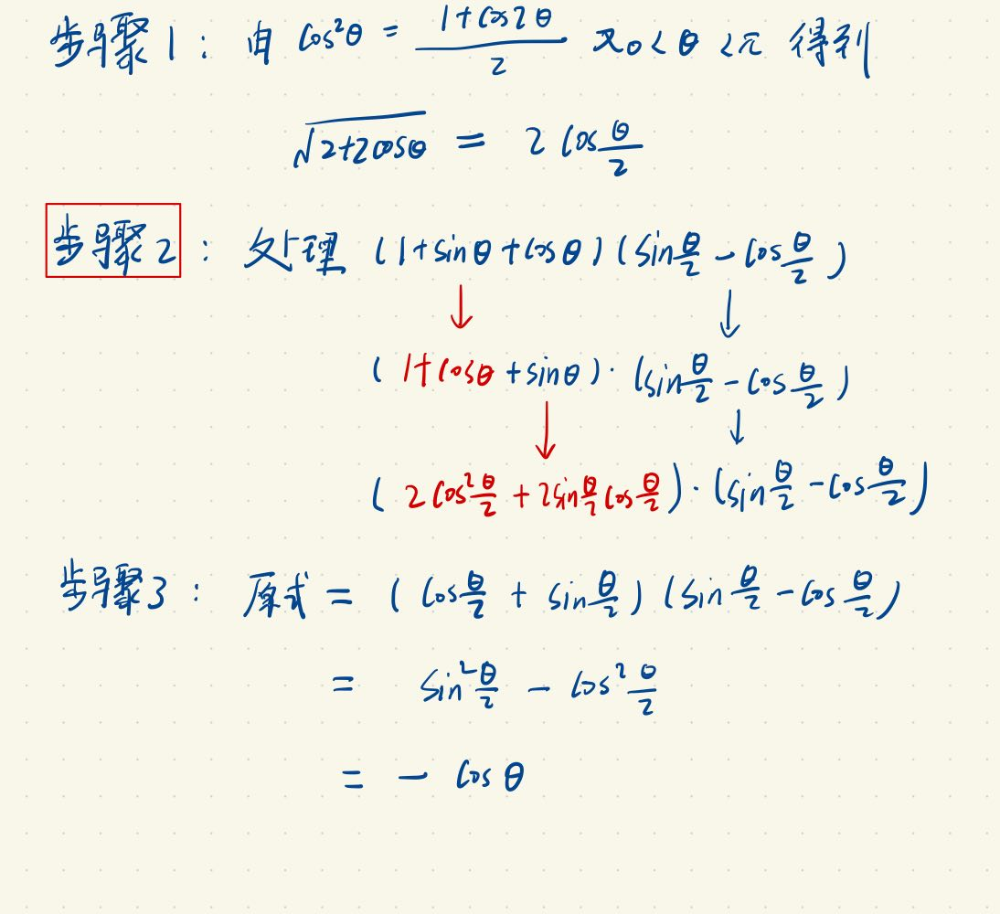

## 三角函数例题I - 三角恒等变换和三角函数化简

已知 $0 < \theta < \pi$，化简 $\dfrac{(1 + \sin \theta + \cos \theta)\left(\sin \frac{\theta}{2} - \cos \frac{\theta}{2}\right)}{\sqrt{2 + 2\cos \theta}}$

点评：
关键在注意到

$$\cos^2 \theta = \dfrac{1 + \cos 2\theta}{2}$$

$$\sin^2 \theta = \dfrac{1 - \cos 2\theta}{2}$$

这样的变换。并观察到题目中存在 $ 1 + \cos\theta $ 的形式反复出现，可以尝试用 $ \cos^2 \theta $ 和 $ \sin^2 \theta $ 来替换。

