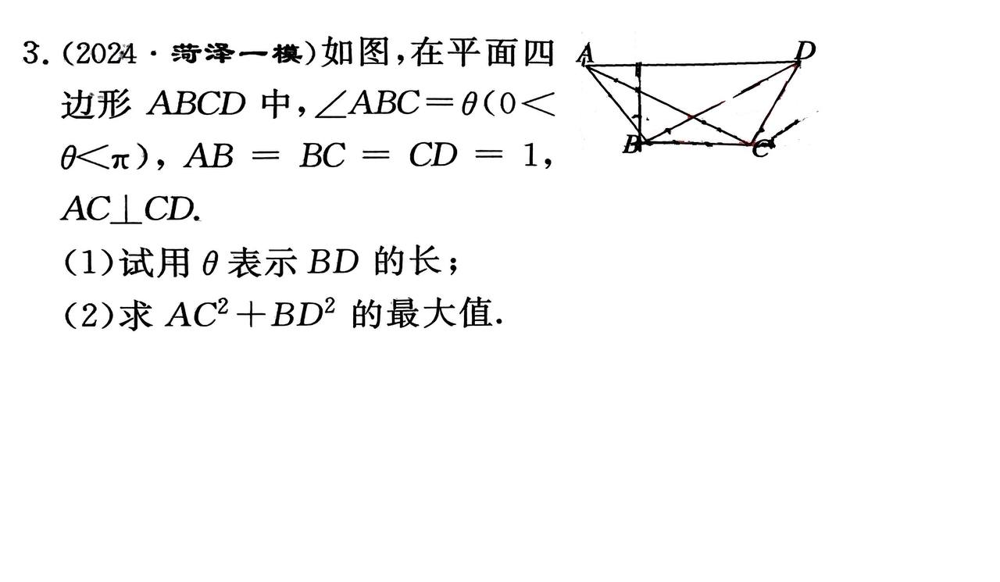

## 解三角形例题II

如图,在平面四边形 $ABCD$ 中, $\angle ABC = \theta$ ($0 < \theta < \pi$), $AB = BC = CD = 1$, $AC\perp CD$。

(1) 试用 $\theta$ 表示 $BD$ 的长;
(2) 求 $AC^2 + BD^2$ 的最大值。

### (1) 用 $\theta$ 表示 $BD$ 的长度

根据图片中的解法:

$$
\begin{align*}
\angle ACB &= \frac{\pi - \theta}{2} \\
\therefore \angle CBD &= \frac{\pi + \theta}{2} + \angle ACB = \pi - \frac{\theta}{2} \\
\therefore \angle CBD &= \boxed{\frac{\theta}{2}}
\end{align*}
$$

由于 $CD = 1$, 我们可以得到:

$$
\begin{align*}
\frac{BD}{\sin\left(\pi - \frac{\theta}{2}\right)} &= \frac{1}{\sin\frac{\theta}{2}} \\
\therefore BD &= \boxed{2\cos\frac{\theta}{4}}
\end{align*}
$$

### (2) 求 $AC^2 + BD^2$ 的最大值

已知 $AC^2 = (1 - \cos \theta)^2 + \sin^2 \theta = 2 - 2\cos\theta$, 将 $BD$ 的表达式代入:

$$
\begin{align*}
AC^2 + BD^2 &= 2 - 2\cos\theta + 4\cos^2\frac{\theta}{4} \\
&= 2 - 2\cos\theta + 2 + 2\cos\frac{\theta}{2} \\
&= 4 - 2\cos\theta + 2\cos\frac{\theta}{2}
\end{align*}
$$

设 $x = \frac{\theta}{2}$, $0 < x < \frac{\pi}{2}$, 则:

$$
\begin{align*}
AC^2 + BD^2 &= 4 - 2\cos2x + 2\cos x \\
&= 4 - 4\cos^2x + 2\cos x \\
&= 6 - 4\cos^2x + 2\cos x
\end{align*}
$$

令 $y = \cos x$, 则 $0 < y < 1$, 上式可以写作:

$$
f(y) = 6 - 4y^2 + 2y
$$

这是一个关于 $y$ 的二次函数。由于二次项系数为负, $f(y)$ 的最大值出现在 $y = \frac{1}{4}$ 时:

$$
\begin{align*}
f\left(\frac{1}{4}\right) &= 6 - 4\left(\frac{1}{4}\right)^2 + 2\left(\frac{1}{4}\right) \\
&= 6 - 1 + \frac{1}{2} \\
&= \boxed{\frac{25}{4}}
\end{align*}
$$

因此, $AC^2 + BD^2$ 的最大值为 $\frac{25}{4}$。