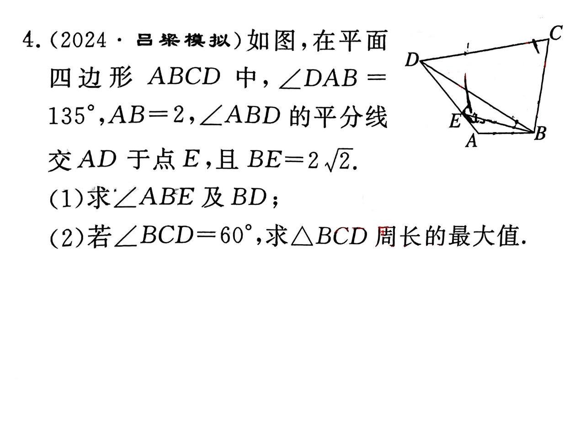

## 解三角形例题III

出自《课时跟踪》P354, T4

### 解题步骤：

#### (1) $\angle ABE$ 及 $BD$ 计算：
多次导角，两次利用正弦定理。
- 根据正弦定理：
$$
\frac{AB}{\sin \angle AEB} = \frac{BE}{\sin \angle DAB}
$$

进而求得 $\angle ABE$, $\angle ABD$, 以及 $\angle ADB$.
再次利用正弦定理，可得 $BD = 2 + 2\sqrt3$

#### (2) 三角形 $\triangle BCD$ 周长最大值：
转化为角的问题，将 $BC$、$CD$ 转化为 $2\mathrm{r} \sin x$ 和 $2\mathrm{r} \sin (\frac{2\pi}{3} - x)$ 转化为三角函数求最值，求得最大周长的值 $6 + 6\sqrt3$.