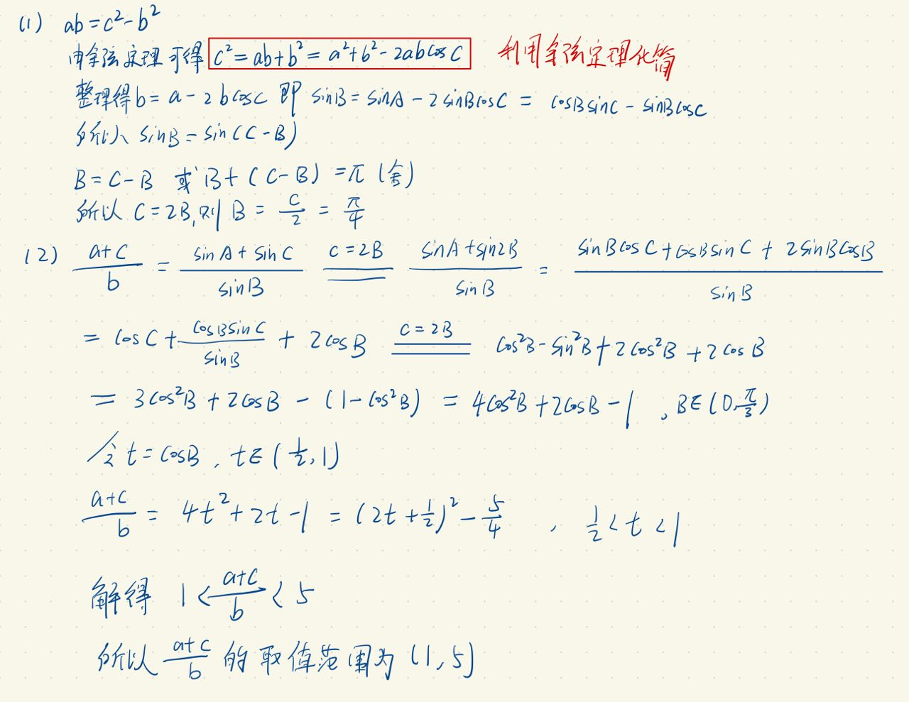

## 解三角形例题IV

### 题目：
已知三角形 $ \triangle ABC $ 中，内角 $A, B, C$ 所对应的边分别为 $a, b, c$，且满足
$$
\frac{\sin A}{\sin B + \sin C} = \frac{c - b}{b}
$$
1. 若 $C = \dfrac{\pi}{2}$，求 $B$；
2. 求 $\dfrac{a + c}{b}$ 的取值范围。

### 解题思路

