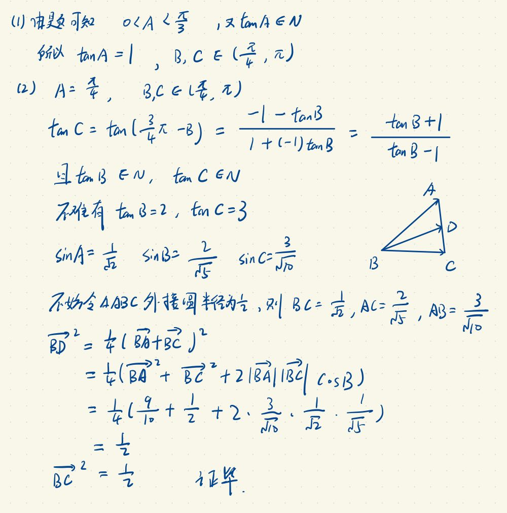

## 解三角形例题V - 非常规解三角

### 题目：

在 $\triangle ABC$ 中，$A < B < C$，且 $\tan A, \tan B, \tan C$ 均为整数。
1. 求 $A$ 的大小；
2. 设 $AC$ 的中点为 $D$，求证：$BC = BD$。

### 思路：

要点在于限制角的范围，用 $\tan B \, \text{表示} \, \tan C$ ，用向量方法证明 $BC = BD$。

### 解题过程：

